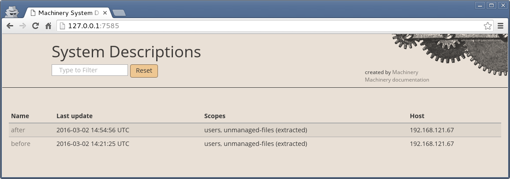
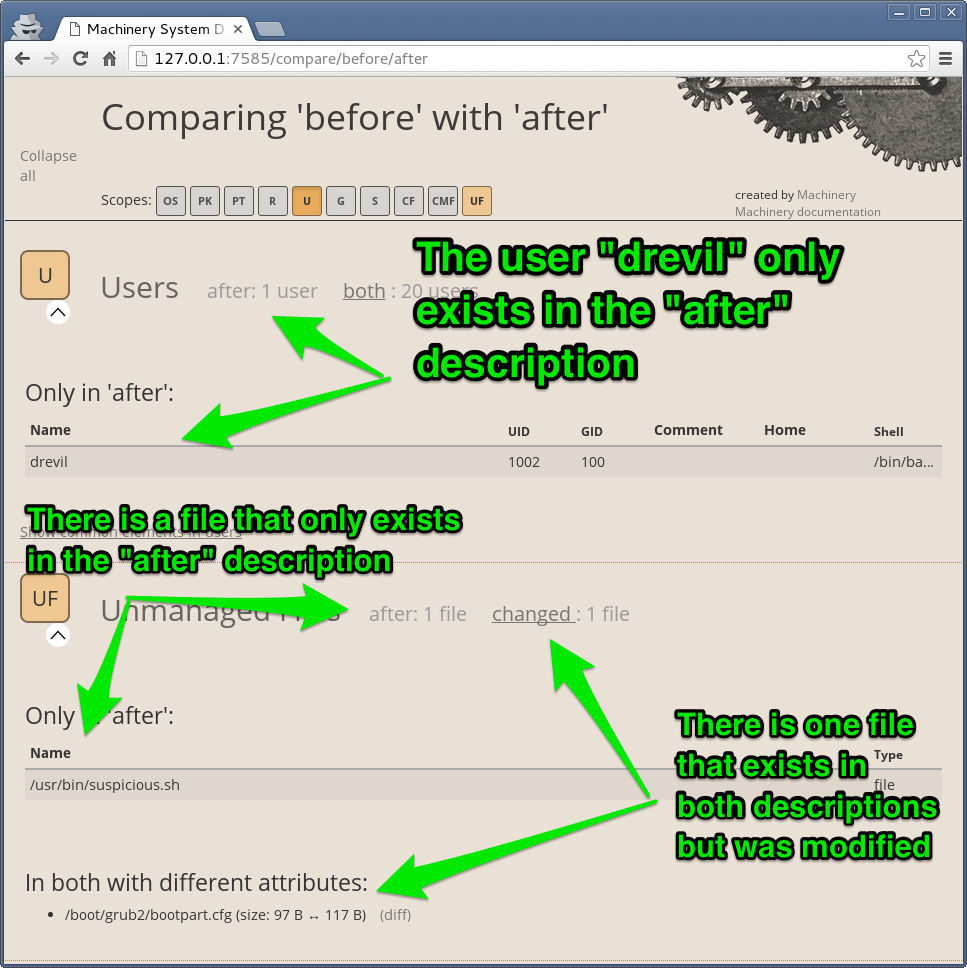
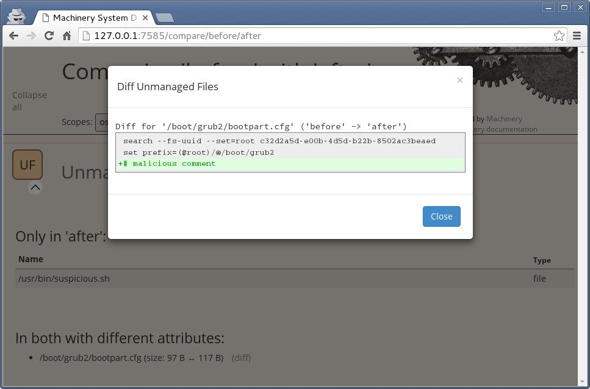

# Tampered server tutorial

## Scenario

A server started behaving strange and you suspect someone has tampered with it.
You want to find out what has changed since the last time you audited it. As
part of your server auditing process you have a system description called
"before" which you saved the last time this server was working as expected.

## Install tutorial

By the default machinery will look for system descriptions inside the
`.machinery` directory in your home. We can change this functionality by setting
the environment variable `MACHINERY_DIR` to point to the folder containing our
example descriptions.

```
$ export MACHINERY_DIR=$(pwd)/machinery
```

Before we get started double check that your system descriptions are listed
correctly with the `list` command:

```
$ machinery list
after:
* users
* unmanaged-files (extracted)

before:
* users
* unmanaged-files (extracted) ```
```

You also have the option to pass an `--html` flag which will start a local
server that can be accessed at http://127.0.0.1:7585/

```
$ machinery list --html
Trying to start a web server for serving the comparison result on
http://127.0.0.1:7585/.

The server can be closed with Ctrl+C.
```



## Finding out what changed

In order to find the differences between the system "before" and "after" it was
tampered you use machinery's `compare` command:

```
$ machinery compare before after
# Users

Only in 'after':
* drevil (N/A, uid: 1002, gid: 100, shell: /bin/bash)

# Unmanaged files

Only in 'after':
* /usr/bin/suspicious.sh (file)

In both with different attributes ('before' <> 'after'):
* /boot/grub2/bootpart.cfg (size: 97 <> 117)
```

From these results we can interpret the following things were modified in the
server:

1. A user called "drevil" was added
2. The file `/usr/bin/suspicios.sh` was added
3. The file `/boot/grub2/bootpart.cfg` was modified

Like with the `list` command we can also pass the `--html` flag to the
`compare` command in order to see the comparison in an HTML view.



> In this particular scenario you are comparing the same system at different
> points in time but the comparison can be done between different systems as
> well.

One benefit of using the HTML view is that for the file that was modified we
can see what exactly was changed by clicking on "diff".



## Uninstall tutorial

If you don't want to use the tutorial any more you can simply unset the
environment variable or close your current shell.

```
$ unset MACHINERY_DIR
```
